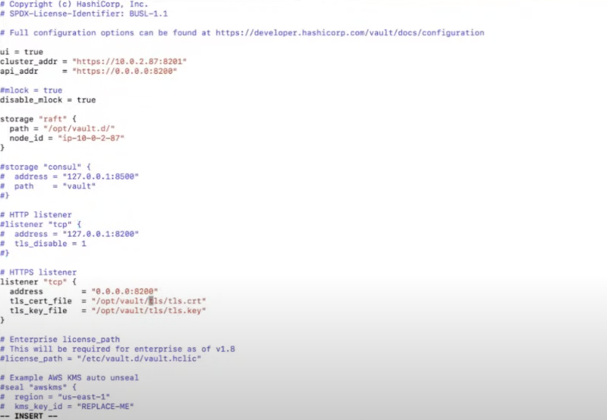

# Getting into HashiCorp Vault, Part 1: Clusters, Seals, & Storage.
## Installing and configuring Vault
1. Vault Architecture: https://developer.hashicorp.com/vault/docs/internals/architecture
2. Installing Vault: https://developer.hashicorp.com/vault/install
3. In order to configure you will need to know the path of vault configurations, for that you can use the command `systemctl status vault` to know where the uni file that starts Vault.
4. Look for `ExecStart` variable as it will point to the binary and configuration file path. usually it is in /etc/vault.d/vault.hcl
5. An example for the configuration is found here https://developer.hashicorp.com/vault/docs/configuration
> **IMPORTANT**  
> - The default storage is file but this is not recommended and you should use RAFT integrated storage.
> - When using the integrated storage you have to set `disable_mlock = true` option which prevents memory swapping. it is commented by default so uncomment the line.
> - Cluster address must be set when using RAFT
> - To troubleshoot why vault is not running you can use `journalctl -fu vault`
6. Make sure to create the folder in the path variable of the storage block as it doesn't get created by default.
7. Change ownership and grant permissions on the storage directory to the vault group `chown vault:vault -R /path/to/storage/directory` and `chmod g+rwx /path/to/storage/directory`
8. Specify 2 global variables (for instance put them under `ui = true`) `cluster_addr` and `api_addr` this will be used for server to server communication.  
For example: `cluster-addr = https://0.0.0.0:8201` and `api_addr = https://0.0.0.0:8200`. 
  
**Configuration sample** 
  
  
9. Now try running Vault using `systemctl start vault` which might produce an error. If vault is not running you can use `vault operator diagnose -config /path/to/configfile`
> **NOTES**
> to create SSL certificate you can use `openssl req -new -newkey rsa:4096 -x509 -keyout vault.key -sha256 -days 365 -nodes -out vault.crt`

10. if Vault is working we need to make sure it is initialized, you can type `vault status` to see if there are any issues. 
11. if the initialized parameter is false run `vault operator init` and run `vault operator unseal` if vault is sealed.  
> Sealed vault means that no one can read or use Vault. it is for a fail safe situations.  
> Vault usually needs 3 keys to unseal but this can be configured.
12. At this point everything should be good, you can try listing the enabled secrets engines on the Vault server using `vault secrets list` which won't work as you need a token to be able to access vault.  
for testing purposes you can set `VAULT_TOKEN` env variable to the root token that the `vault operator init` command created before. alternatively you can use `vault login` which will give you a token as well.
13. There are different secrets engines, the most used is the kv (key-value) secrests engine. to enable the kv run `vault secrets enable -version=2 kv` 
> the -version flag sets a specific version to be enabled. version 2 has versioning enabled and other features.
 